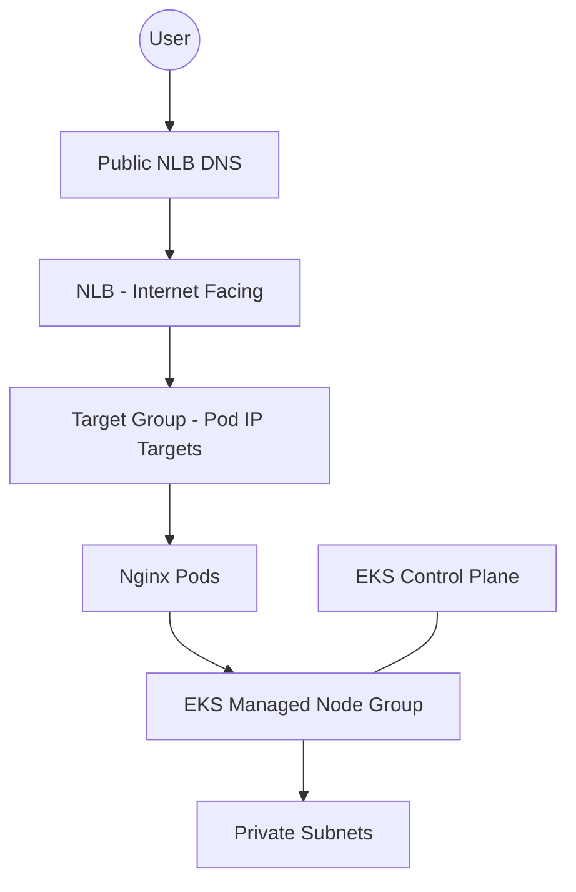

# eks-full-mastery 🚀

**Production-grade AWS EKS cluster built with Terraform + Kubernetes addons + NLB + autoscaling**

This repository demonstrates real-world, production-level EKS competency, including:

- **Terraform-provisioned EKS cluster** (VPC, subnets, node groups, OIDC)
- **AWS Load Balancer Controller** (ALB/NLB integration)
- **Metrics Server**
- **Cluster Autoscaler** with IRSA + ASG auto-discovery
- **NGINX application** exposed through an internet-facing **NLB** with **pod-IP targets**
- Fully validated with healthy AWS Target Groups and **HTTP 200 OK** responses

---

## 🏗️ Architecture (High-Level)

---

## 🌩️ AWS EKS Project: Terraform + Load Balancers + Autoscaling

This lab demonstrates a fully automated, production-grade EKS deployment including:

### 🔹 Terraform (Infrastructure as Code)
- Custom VPC with public & private subnets  
- IAM Roles for Service Accounts (IRSA)  
- EKS cluster + managed node groups  
- Automated OIDC integration  

### 🔹 Kubernetes Addons
- **AWS Load Balancer Controller**  
- **Metrics Server**  
- **Cluster Autoscaler** with ASG auto-discovery  

### 🔹 Application Deployment
- NGINX deployment running on EKS  
- Exposed using `Service: LoadBalancer`  
- Automatically provisions an **internet-facing NLB**  
- Pod IPs registered as **healthy IP targets**  
- Verified via public NLB DNS (HTTP 200 OK)  

### 🔹 Skills Demonstrated
- End-to-end EKS provisioning using Terraform  
- Kubernetes addon lifecycle management  
- AWS networking + ingress/egress architecture  
- NLB/ALB integration via controller  
- Autoscaling with ASG + Cluster Autoscaler  
- Troubleshooting ELB/NLB, Target Groups & health checks  
- Full build → validate → teardown workflow  

---

## 🎯 Summary

This project provisions a **fully automated, production-grade Amazon EKS environment** using Infrastructure as Code and Kubernetes best practices.

---
